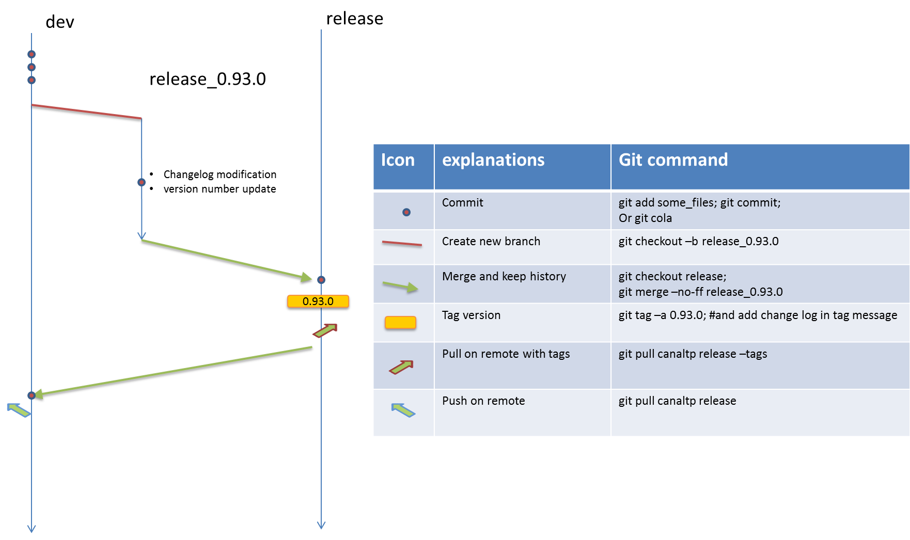

# generic git release script
 
 The script performs a git release of a project
 
 The Release process is very simple, it merges a development branch (usually called 'master' or 'dev') to the 
 release 
 branch (usually called 'release'). After the merge the release branch is tagged with the new version number.
 
 
 
 A changelog can be created using github pullrequest merged since last release.

## Installation

`pip install githubflow_release`

## Script usage
 
 To know all the parameters use the --help option.
 
 since for a project some options need to be consistent, you can create a `githubflow_release.yml` in the root
  directory of your project to give some default values.
  The values are overridden if given in the command lines.
  
  example of `githubflow_release.yml`:
  
  ```yml
# configuration of my project release
# used by https://github.com/CanalTP/githubflow_release
github_repo: CanalTP/my_project
base_branch: master
generate_debian_changelog: False
excluded_pr_tag: [hotfix, not_in_changelog, my_tag]
  ```
 
 With nice defaults for you project, to do a release you can just do:
 
 ```
 cd my_project;
 githubflow_release --release-type minor
 ```
 
 github might be limiting your access to their API. If so you need to provide some github credential.
 
 if so either generate a custom token (the best way) or use your own github password (DO NOT PUT it into 
 you configuration file):
 
 ```
 githubflow_release --release-type minor --github-user 'my_github_login' --github-token 'my_github_custom_token_or_password'
 ```
 

